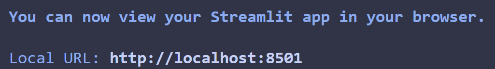

# I.BA_DVIZ_MM.FINAL_PROJECT

## Requirements

- Virtual environment
- pip
- Was tested on python 3.12.3

## Installation
Create and activate your virtual environment.

Install dependencies using the following command:

```bash
pip install -r requirements.txt
```
## How to run
Make sure you are in the root directory of the project (where streamlit_app.py is) and make sure your virtual environment with the installed dependencies is active.

Then run:
```bash
streamlit run streamlit_app.py
```

In the terminal you should see an output like this:



Open the local URL in your browser.